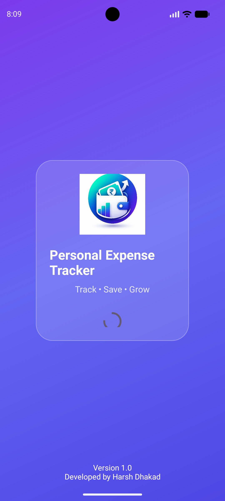
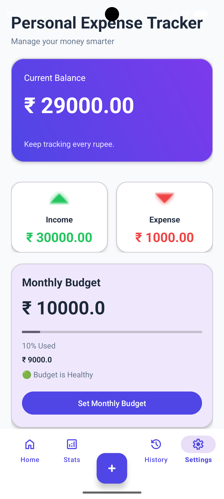
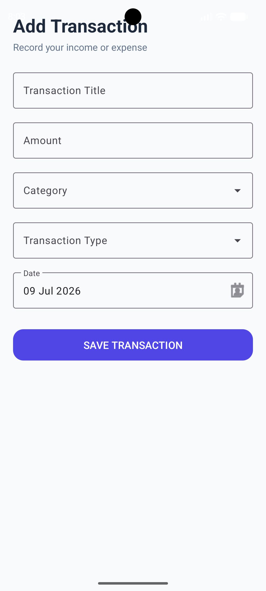
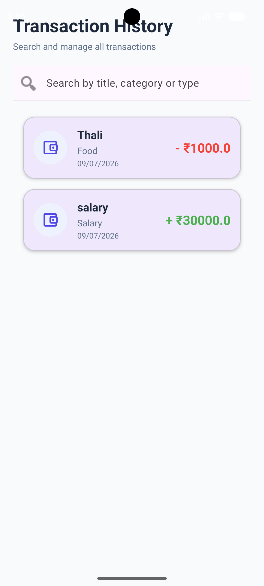
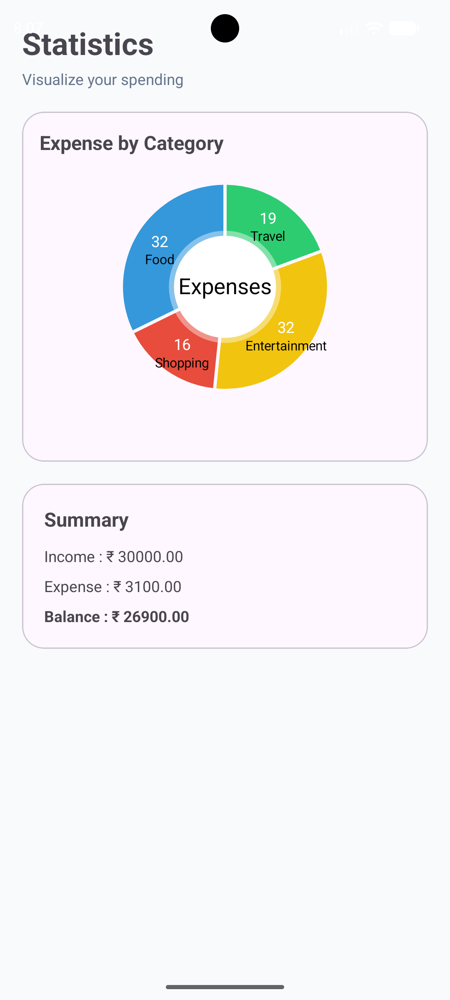
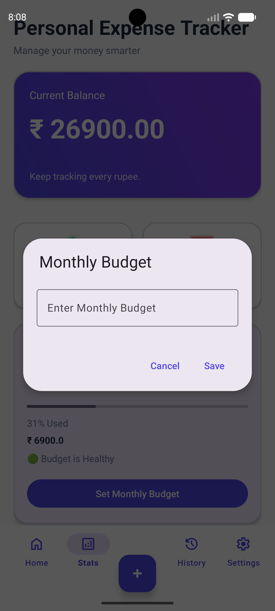
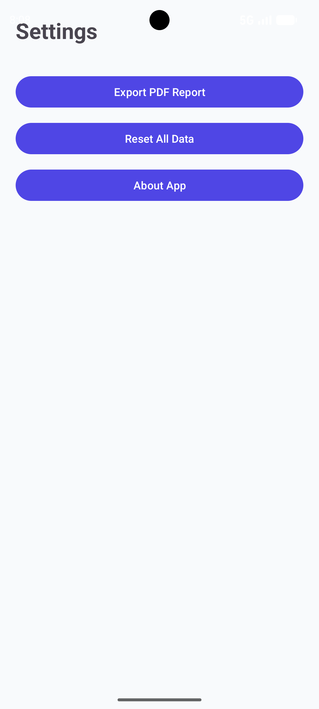

# 💰 Personal Expense Tracker

## 📌 Intern Information

- **Intern ID:** CITS3045
- **Name:** Harsh Dhakad
- **Company:** CODTECH IT Solutions
- **Domain:** Android Development
- **Duration:** 4 Weeks

---

# 📱 Project Name

Personal Expense Tracker

---

# 📖 Project Description

The Personal Expense Tracker is an Android application developed using **Java**, **Android Studio**, and **SQLite Database**. It helps users manage their daily income and expenses efficiently with a modern and user-friendly interface.

The application allows users to add, edit, delete, search, and categorize transactions while providing monthly budget management, expense statistics, and PDF report export.

---

# ✨ Features

- 💰 Add Income
- 💸 Add Expense
- ✏️ Edit Transactions
- 🗑 Delete Transactions
- 📜 Transaction History
- 🔍 Search Transactions
- 📊 Dashboard Summary
- 📅 Monthly Budget Management
- 📈 Budget Progress Indicator
- 📉 Budget Usage Percentage
- ⚠️ Budget Status (Healthy / High / Exceeded)
- 🥧 Category-wise Expense Statistics (Pie Chart)
- 📄 Export Expense Report as PDF
- 🚀 Beautiful Splash Screen
- 💾 SQLite Database Storage
- 🎨 Modern Material UI

---

# 🛠 Technologies Used

- Java
- Android Studio
- XML
- SQLite Database
- ViewBinding
- Material Design 3
- MPAndroidChart
- RecyclerView
- FileProvider (PDF Sharing)

---

# 🎯 Project Scope

This application helps users monitor their financial activities by keeping track of income, expenses, and monthly budgets. It provides graphical insights through category-wise statistics and allows users to export expense reports in PDF format, making personal finance management simple and efficient.

---

# 📂 Repository Contains

- ✔ Source Code
- ✔ README File
- ✔ Screenshots
- ✔ Documentation
- ✔ Output Images

---

# 🚀 Future Improvements

- ☁ Cloud Backup (Firebase)
- 👤 User Authentication
- 📅 Monthly & Yearly Reports
- 📊 Bar Chart & Line Chart Analytics
- 🔔 Budget Reminder Notifications
- 💱 Multi-Currency Support
- 🌙 Dark Mode
- ☁ Google Drive Backup & Restore

---

# 📸 Screenshots

## Splash

## Dashboard

## Add Transaction

## Transaction History

## Statistics

## Monthly Budget

## Settings

---

# 📄 Documentation

Project Documentation:

- [Personal_Expense_Tracker_Documentation.pdf](Documentation/Personal_Expense_Tracker_Documentation.pdf)

---

# 👨‍💻 Developer

**Harsh Dhakad**

**CODTECH Internship Project**

**2026**
